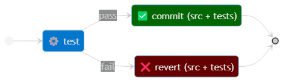

# TCR Variants

TCR tool can run several variants of TCR, inspired by [this blog post](https://medium.com/@tdeniffel/tcr-variants-test-commit-revert-bf6bd84b17d3)
by Thomas Deniffel.

We encourage you to read through Thomas's blog post for a deeper understanding of how these
variants differ and what each of them can bring.

The selection of which variant TCR will be applying is done at launch time through
TCR's tool `--variant` (or `-r`) command-line option.

The variants currently supported by TCR tool are the following:

- The Original (not yet supported)
- BTCR
- The Relaxed (default)
- The introspective

The state diagrams below summarize the behavior of each variant.

## The Original

```shell
tcr --variant=original
```



## BTCR - Build && Test && Commit || Revert

> This version tries to build the software first. If it fails, nothing is
> executed — no commit, no revert. Compilation-Issue solved.

```shell
tcr --variant=btcr
```


## The Relaxed

> The second issue of the original suggestion is that your unit-tests get deleted all the time. 
> The idea is, not to reset the ‘test’ folder but only the ‘src’ folder.

```shell
tcr --variant=relaxed
```

The above option `--variant=relaxed` may be omitted as this is the default variant.


## The Introspective

This is an extension to the BTCR variant. Instead of simply reverting changes locally, it commits the failing
changes, and straightaway commits a revert commit to get back to a green state. The goal is to be able to
retrospect on one's progress through a task. It's useful during deliberate practice sessions, but could also
serve in day to day coding.

```shell
tcr --variant=introspective
```


