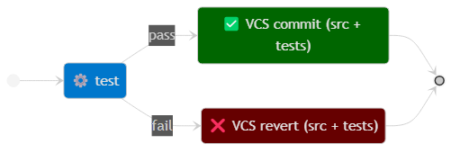

# TCR Variants

TCR tool can run several variants of TCR, as described in
[this blog post](https://medium.com/@tdeniffel/tcr-variants-test-commit-revert-bf6bd84b17d3)
by Thomas Deniffel.

We encourage you to read through Thomas's blog post for a deeper understanding of how these
variants differ and what each of them can bring.

The selection of which variant TCR will be applying is done at launch time through
TCR's tool `--variant` (or `-r`) command-line option.

The variants currently supported by TCR tool are the following:

- The Original
- BTCR
- The Relaxed (default)

The state diagrams below summarize the behavior of each variant.

## The Original

```shell
tcr --variant=original
```



## BTCR - Build && Test && Commit || Revert

```shell
tcr --variant=btcr
```


## The Relaxed

```shell
tcr --variant=relaxed
```

The above option `--variant=relaxed` may be omitted as this is the default variant.


